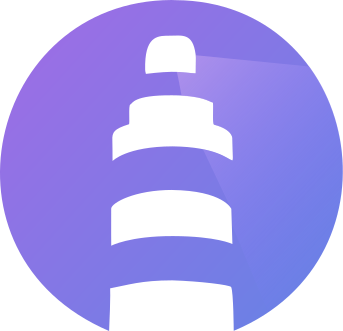

    

# Home Kubernetes cluster 🚢

[![Discord](https://img.shields.io/badge/discord-chat-5865F2.svg?maxAge=60&style=for-the-badge&logo=data:image/svg+xml;base64,PD94bWwgdmVyc2lvbj0iMS4wIiBlbmNvZGluZz0iVVRGLTgiPz4KPHN2ZyB3aWR0aD0iMjU2cHgiIGhlaWdodD0iMjU2cHgiIHZpZXdCb3g9IjAgLTI4LjUgMjU2IDI1NiIgdmVyc2lvbj0iMS4xIiB4bWxucz0iaHR0cDovL3d3dy53My5vcmcvMjAwMC9zdmciIHhtbG5zOnhsaW5rPSJodHRwOi8vd3d3LnczLm9yZy8xOTk5L3hsaW5rIiBwcmVzZXJ2ZUFzcGVjdFJhdGlvPSJ4TWlkWU1pZCI+CiAgICA8Zz4KICAgICAgICA8cGF0aCBkPSJNMjE2Ljg1NjMzOSwxNi41OTY2MDMxIEMyMDAuMjg1MDAyLDguODQzMjg2NjUgMTgyLjU2NjE0NCwzLjIwODQ5ODggMTY0LjA0MTU2NCwwIEMxNjEuNzY2NTIzLDQuMTEzMTgxMDYgMTU5LjEwODYyNCw5LjY0NTQ5OTA4IDE1Ny4yNzYwOTksMTQuMDQ2NDM3OSBDMTM3LjU4Mzk5NSwxMS4wODQ5ODk2IDExOC4wNzI5NjcsMTEuMDg0OTg5NiA5OC43NDMwMTYzLDE0LjA0NjQzNzkgQzk2LjkxMDg0MTcsOS42NDU0OTkwOCA5NC4xOTI1ODM4LDQuMTEzMTgxMDYgOTEuODk3MTg5NSwwIEM3My4zNTI2MDY4LDMuMjA4NDk4OCA1NS42MTMzOTQ5LDguODYzOTkxMTcgMzkuMDQyMDU4MywxNi42Mzc2NjEyIEM1LjYxNzUyMjkzLDY3LjE0NjUxNCAtMy40NDMzMTkxLDExNi40MDA4MTMgMS4wODcxMTA2OSwxNjQuOTU1NzIxIEMyMy4yNTYwMTk2LDE4MS41MTA5MTUgNDQuNzQwMzYzNCwxOTEuNTY3Njk3IDY1Ljg2MjEzMjUsMTk4LjE0ODU3NiBDNzEuMDc3MjE1MSwxOTAuOTcxMTI2IDc1LjcyODM2MjgsMTgzLjM0MTMzNSA3OS43MzUyMTM5LDE3NS4zMDAyNjEgQzcyLjEwNDAxOSwxNzIuNDAwNTc1IDY0Ljc5NDk3MjQsMTY4LjgyMjIwMiA1Ny44ODg3ODY2LDE2NC42Njc5NjMgQzU5LjcyMDk2MTIsMTYzLjMxMDU4OSA2MS41MTMxMzA0LDE2MS44OTE0NTIgNjMuMjQ0NTg5OCwxNjAuNDMxMjU3IEMxMDUuMzY3NDEsMTgwLjEzMzE4NyAxNTEuMTM0OTI4LDE4MC4xMzMxODcgMTkyLjc1NDUyMywxNjAuNDMxMjU3IEMxOTQuNTA2MzM2LDE2MS44OTE0NTIgMTk2LjI5ODE1NCwxNjMuMzEwNTg5IDE5OC4xMTAzMjYsMTY0LjY2Nzk2MyBDMTkxLjE4Mzc4NywxNjguODQyNTU2IDE4My44NTQ3MzcsMTcyLjQyMDkyOSAxNzYuMjIzNTQyLDE3NS4zMjA5NjUgQzE4MC4yMzAzOTMsMTgzLjM0MTMzNSAxODQuODYxNTM4LDE5MC45OTE4MzEgMTkwLjA5NjYyNCwxOTguMTY4OTMgQzIxMS4yMzg3NDYsMTkxLjU4ODA1MSAyMzIuNzQzMDIzLDE4MS41MzE2MTkgMjU0LjkxMTk0OSwxNjQuOTU1NzIxIEMyNjAuMjI3NzQ3LDEwOC42NjgyMDEgMjQ1LjgzMTA4Nyw1OS44NjYyNDMyIDIxNi44NTYzMzksMTYuNTk2NjAzMSBaIE04NS40NzM4NzUyLDEzNS4wOTQ4OSBDNzIuODI5MDI4MSwxMzUuMDk0ODkgNjIuNDU5MjIxNywxMjMuMjkwMTU1IDYyLjQ1OTIyMTcsMTA4LjkxNDkwMSBDNjIuNDU5MjIxNyw5NC41Mzk2NDcyIDcyLjYwNzU5NSw4Mi43MTQ1NTg3IDg1LjQ3Mzg3NTIsODIuNzE0NTU4NyBDOTguMzQwNTA2NCw4Mi43MTQ1NTg3IDEwOC43MDk5NjIsOTQuNTE4OTQyNyAxMDguNDg4NTI5LDEwOC45MTQ5MDEgQzEwOC41MDg1MzEsMTIzLjI5MDE1NSA5OC4zNDA1MDY0LDEzNS4wOTQ4OSA4NS40NzM4NzUyLDEzNS4wOTQ4OSBaIE0xNzAuNTI1MjM3LDEzNS4wOTQ4OSBDMTU3Ljg4MDM5LDEzNS4wOTQ4OSAxNDcuNTEwNTg0LDEyMy4yOTAxNTUgMTQ3LjUxMDU4NCwxMDguOTE0OTAxIEMxNDcuNTEwNTg0LDk0LjUzOTY0NzIgMTU3LjY1ODYwNiw4Mi43MTQ1NTg3IDE3MC41MjUyMzcsODIuNzE0NTU4NyBDMTgzLjM5MTUxOCw4Mi43MTQ1NTg3IDE5My43NjEzMjQsOTQuNTE4OTQyNyAxOTMuNTM5ODkxLDEwOC45MTQ5MDEgQzE5My41Mzk4OTEsMTIzLjI5MDE1NSAxODMuMzkxNTE4LDEzNS4wOTQ4OSAxNzAuNTI1MjM3LDEzNS4wOTQ4OSBaIiBmaWxsPSIjNTg2NUYyIiBmaWxsLXJ1bGU9Im5vbnplcm8iPjwvcGF0aD4KICAgIDwvZz4KPC9zdmc+)](https://discord.gg/sTMX7Vh)

[![renovate](https://img.shields.io/badge/renovate-enabled-green?style=for-the-badge&logo=data:image/svg+xml;base64,PHN2ZyB4bWxucz0iaHR0cDovL3d3dy53My5vcmcvMjAwMC9zdmciIHZpZXdCb3g9IjUgNSAzNzAgMzcwIj48Y2lyY2xlIGN4PSIxODkiIGN5PSIxOTAiIHI9IjE4NCIgZmlsbD0iI2ZlMiIvPjxwYXRoIGZpbGw9IiM4YmIiIGQ9Ik0yNTEgMjU2bC0zOC0zOGExNyAxNyAwIDAxMC0yNGw1Ni01NmMyLTIgMi02IDAtN2wtMjAtMjFhNSA1IDAgMDAtNyAwbC0xMyAxMi05LTggMTMtMTNhMTcgMTcgMCAwMTI0IDBsMjEgMjFjNyA3IDcgMTcgMCAyNGwtNTYgNTdhNSA1IDAgMDAwIDdsMzggMzh6Ii8+PHBhdGggZmlsbD0iI2Q1MSIgZD0iTTMwMCAyODhsLTggOGMtNCA0LTExIDQtMTYgMGwtNDYtNDZjLTUtNS01LTEyIDAtMTZsOC04YzQtNCAxMS00IDE1IDBsNDcgNDdjNCA0IDQgMTEgMCAxNXoiLz48cGF0aCBmaWxsPSIjYjMwIiBkPSJNMjg1IDI1OGw3IDdjNCA0IDQgMTEgMCAxNWwtOCA4Yy00IDQtMTEgNC0xNiAwbC02LTdjNCA1IDExIDUgMTUgMGw4LTdjNC01IDQtMTIgMC0xNnoiLz48cGF0aCBmaWxsPSIjYTMwIiBkPSJNMjkxIDI2NGw4IDhjNCA0IDQgMTEgMCAxNmwtOCA3Yy00IDUtMTEgNS0xNSAwbC05LThjNSA1IDEyIDUgMTYgMGw4LThjNC00IDQtMTEgMC0xNXoiLz48cGF0aCBmaWxsPSIjZTYyIiBkPSJNMjYwIDIzM2wtNC00Yy02LTYtMTctNi0yMyAwLTcgNy03IDE3IDAgMjRsNCA0Yy00LTUtNC0xMSAwLTE2bDgtOGM0LTQgMTEtNCAxNSAweiIvPjxwYXRoIGZpbGw9IiNiNDAiIGQ9Ik0yODQgMzA0Yy00IDAtOC0xLTExLTRsLTQ3LTQ3Yy02LTYtNi0xNiAwLTIybDgtOGM2LTYgMTYtNiAyMiAwbDQ3IDQ2YzYgNyA2IDE3IDAgMjNsLTggOGMtMyAzLTcgNC0xMSA0em0tMzktNzZjLTEgMC0zIDAtNCAybC04IDdjLTIgMy0yIDcgMCA5bDQ3IDQ3YTYgNiAwIDAwOSAwbDctOGMzLTIgMy02IDAtOWwtNDYtNDZjLTItMi0zLTItNS0yeiIvPjxwYXRoIGZpbGw9IiMxY2MiIGQ9Ik0xNTIgMTEzbDE4LTE4IDE4IDE4LTE4IDE4em0xLTM1bDE4LTE4IDE4IDE4LTE4IDE4em0tOTAgODlsMTgtMTggMTggMTgtMTggMTh6bTM1LTM2bDE4LTE4IDE4IDE4LTE4IDE4eiIvPjxwYXRoIGZpbGw9IiMxZGQiIGQ9Ik0xMzQgMTMxbDE4LTE4IDE4IDE4LTE4IDE4em0tMzUgMzZsMTgtMTggMTggMTgtMTggMTh6Ii8+PHBhdGggZmlsbD0iIzJiYiIgZD0iTTExNiAxNDlsMTgtMTggMTggMTgtMTggMTh6bTU0LTU0bDE4LTE4IDE4IDE4LTE4IDE4em0tODkgOTBsMTgtMTggMTggMTgtMTggMTh6bTEzOS04NWwyMyAyM2M0IDQgNCAxMSAwIDE2TDE0MiAyNDBjLTQgNC0xMSA0LTE1IDBsLTI0LTI0Yy00LTQtNC0xMSAwLTE1bDEwMS0xMDFjNS01IDEyLTUgMTYgMHoiLz48cGF0aCBmaWxsPSIjM2VlIiBkPSJNMTM0IDk1bDE4LTE4IDE4IDE4LTE4IDE4em0tNTQgMThsMTgtMTcgMTggMTctMTggMTh6bTU1LTUzbDE4LTE4IDE4IDE4LTE4IDE4em05MyA0OGwtOC04Yy00LTUtMTEtNS0xNiAwTDEwMyAyMDFjLTQgNC00IDExIDAgMTVsOCA4Yy00LTQtNC0xMSAwLTE1bDEwMS0xMDFjNS00IDEyLTQgMTYgMHoiLz48cGF0aCBmaWxsPSIjOWVlIiBkPSJNMjcgMTMxbDE4LTE4IDE4IDE4LTE4IDE4em01NC01M2wxOC0xOCAxOCAxOC0xOCAxOHoiLz48cGF0aCBmaWxsPSIjMGFhIiBkPSJNMjMwIDExMGwxMyAxM2M0IDQgNCAxMSAwIDE2TDE0MiAyNDBjLTQgNC0xMSA0LTE1IDBsLTEzLTEzYzQgNCAxMSA0IDE1IDBsMTAxLTEwMWM1LTUgNS0xMSAwLTE2eiIvPjxwYXRoIGZpbGw9IiMxYWIiIGQ9Ik0xMzQgMjQ4Yy00IDAtOC0yLTExLTVsLTIzLTIzYTE2IDE2IDAgMDEwLTIzTDIwMSA5NmExNiAxNiAwIDAxMjIgMGwyNCAyNGM2IDYgNiAxNiAwIDIyTDE0NiAyNDNjLTMgMy03IDUtMTIgNXptNzgtMTQ3bC00IDItMTAxIDEwMWE2IDYgMCAwMDAgOWwyMyAyM2E2IDYgMCAwMDkgMGwxMDEtMTAxYTYgNiAwIDAwMC05bC0yNC0yMy00LTJ6Ii8+PC9zdmc+)](https://github.com/renovatebot/renovate)

 

## 📚 Overview

This is home to my personal Kubernetes cluster. [Flux](https://github.com/fluxcd/flux2) watches this Git repository and makes the changes to my cluster based on the manifests in the [cluster](./cluster/) directory.
For more information, head on over to my [docs](https://cbirkenbeul.github.io/k3s-gitops/).

 

## 🚀 Technologies
This cluster utilizes a variety of open-source technologies to provide a robust and reliable infrastructure.

- k3s - a lightweight Kubernetes distribution optimized for resource-constrained environments
- cert-manager - a Kubernetes add-on for automating the management and issuance of TLS certificates from various issuing sources.
- external-dns - a Kubernetes add-on that automatically creates and updates DNS records for Kubernetes services.
- pre-commit - a framework for managing and maintaining multi-language pre-commit hooks.
- renovate - an automated dependency update tool that integrates with GitHub and GitLab for streamlined dependency management.

 

## 🔧 Maintenance
This cluster is maintained and updated regularly to ensure a high level of availability and security. RenovateBot is used to automatically keep dependencies up-to-date and prevent vulnerabilities. Additionally, pre-commit hooks are used to catch and fix errors before they are committed to the repository.

 

## 📝 Note
Please note that this is my personal cluster, and is not intended for production use. It is provided as a reference and for educational purposes only.

 

## 🤝 Community
Thanks to all the people who donate their time to the [Kubernetes@Home](https://github.com/k8s-at-home/) community

    

