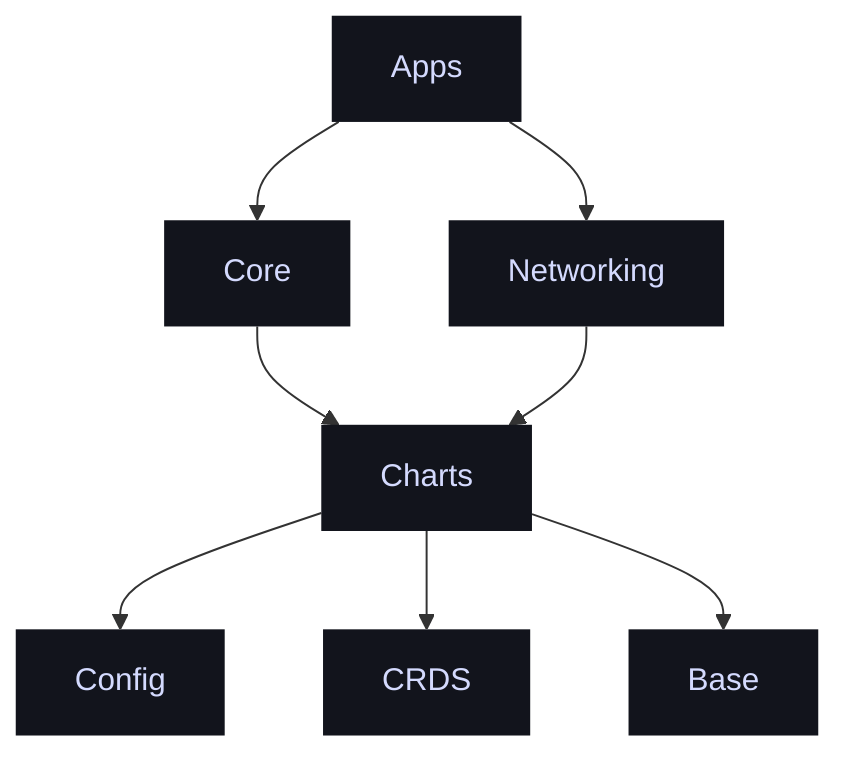
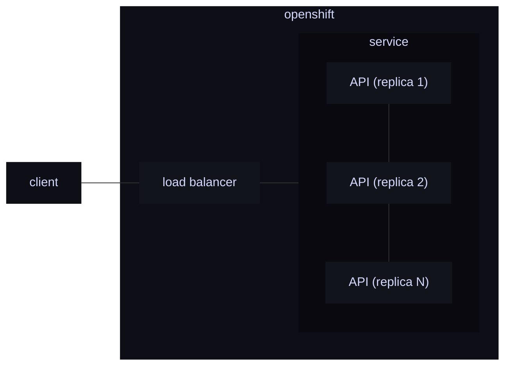

# Cluster overview.

{: style="height:450px"}

### 🟣 Nodes.

| **Hostname** | **Model**   | **CPU**    | **Memory** | **Role** | **Operating System**    |
| ------------ | ----------- | ---------- | ---------- | -------- | ----------------------- |
| Pipboy       | RNUC11PAKI5 | i5-1135G7  | 16GB       | Master   | Ubuntu Server 22.04 LTS |
| Lighthouse   | NUC8i5BEK   | i5-8259U   | 16GB       | Master   | Ubuntu Server 22.04 LTS |
| Persephone   | NUC8i5BEK   | i5-8259U   | 16GB       | Master   | Ubuntu Server 22.04 LTS |
| Arcadia      | NUC8i5BEK   | i5-8259U   | 16GB       | Worker   | Ubuntu Server 22.04 LTS |
| Hephaestus   | NUC8i5BEK   | i5-8259U   | 16GB       | Worker   | Ubuntu Server 22.04 LTS |
| `Total`      |             | `20c/40t ` | `80GB`     |          |                         |

### 🌱 Environment.

| **Role**          | **Device**                  |
| ----------------- | --------------------------- |
| **Router**        | Mikrotik RB4011iGS.         |
| **NAS1**          | Helios64 by Kobol           |
| **NAS2**          | Synology DS918+             |
| **Access Points** | 2 x UAP-FlexHD Meshed       |
| **Cooling**       | AC Infinity AIRPLATE T8 PRO |

### ⚖️ Dependancy structure.

