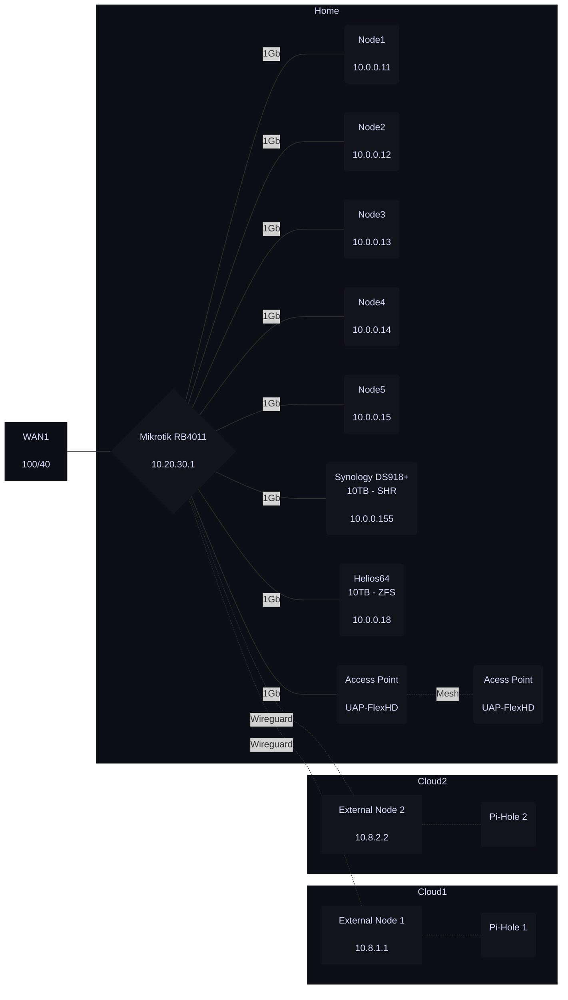

```mermaid

graph LR
linkStyle default interpolate basis
wan1[<center>WAN1<br><br>100/40</center>]
---router{<center>Mikrotik RB4011<br><br>10.20.30.1</center>}
%%   ^^ extra .
router-.-|Wireguard|ExternalNode1[<center>External Node 1<br><br>10.8.1.1</center>]
router-.-|Wireguard|ExternalNode2[<center>External Node 2<br><br>10.8.2.2</center>]
subgraph Home
    router---|1Gb|Node1(<center>Node1<br><br>10.0.0.11</center>)
    router---|1Gb|Node2(<center>Node2<br><br>10.0.0.12</center>)
    router---|1Gb|Node3(<center>Node3<br><br>10.0.0.13</center>)
    router---|1Gb|Node4(<center>Node4<br><br>10.0.0.14</center>)
    router---|1Gb|Node5(<center>Node5<br><br>10.0.0.15</center>)
    router---|1Gb|NAS1(<center>Synology DS918+<br>10TB - SHR</br><br>10.0.0.155</br></center>)
    router---|1Gb|NAS2(<center>Helios64<br>10TB - ZFS</br><br>10.0.0.18</br></center>)
    router---|1Gb|AP1(<center>Access Point<br><br>UAP-FlexHD</center>)
    AP1-.-|Mesh|AP2(<center>Acess Point<br><br>UAP-FlexHD</center>)
end
subgraph Cloud1
    ExternalNode1-.-PiHole1(<center>Pi-Hole 1<br><br></center>)
end
subgraph Cloud2
    ExternalNode2-.-PiHole2(<center>Pi-Hole 2<br><br></center>)
end

classDef fill fill:#12141c,stroke:#333,stroke-width:0px,color:#d4dafe
classDef zone fill:#0e0f16,stroke:#333,stroke-width:0px,color:#d4dafe
classDef outside fill:#0e0f16,stroke:#333,stroke-width:0px,color:#d4dafe

class router,Node1,Node2,Node3,Node4,Node5,NAS1,NAS2,AP1,AP2,ExternalNode1,ExternalNode2,PiHole1,PiHole2 fill
class Home,Cloud1,Cloud2 zone
class wan1 outside
```
