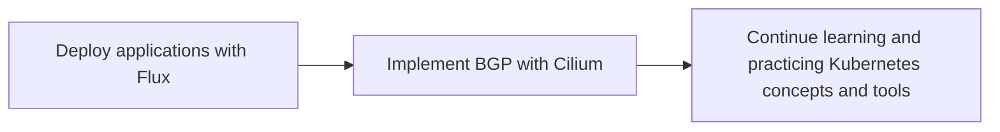

# My Roadmap for future

## Overview

The next steps I need to take in order to advance my Kubernetes skills

1. Deploying applications remaining services in existing technology stack.
2. Implementing BGP routing with Cilium to enable communication between pods in different nodes.
3. Continuing to learn and practice with Kubernetes concepts and tools, such as kubectl and Kubernetes API objects, in order to prepare for the CKA certification exam.

## Mermaid Diagram

This roadmap will help guide you in furthering your knowledge and skills with k3s, Flux, and GitOps, and ultimately prepare you for the CKA certification exam.
